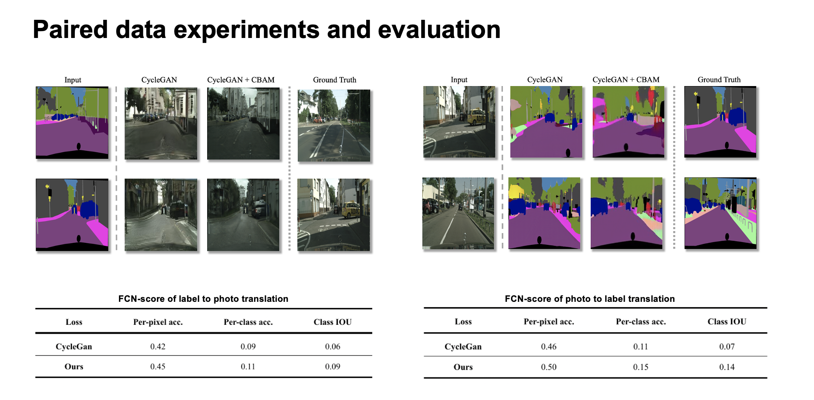
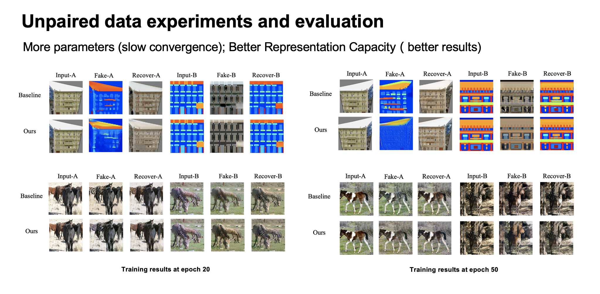
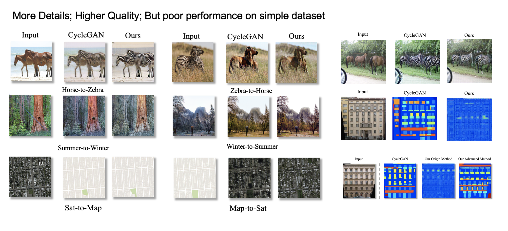
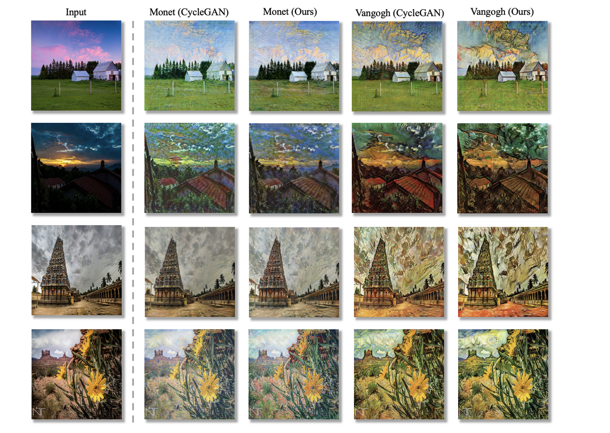
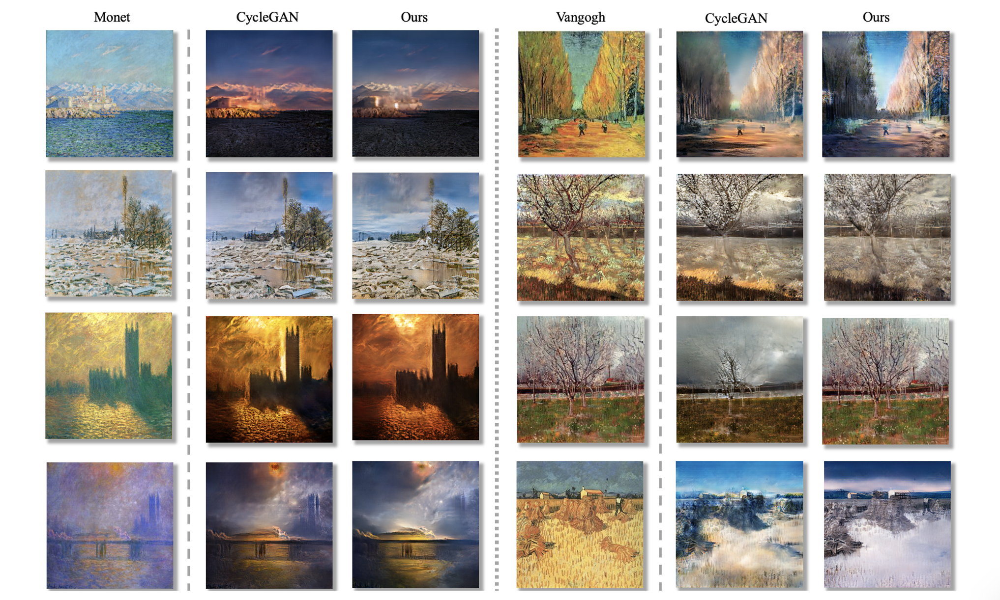

# 将注意力机制引入循环一致的对抗性网络

## 实验环境

### 数据集与模型

相关数据集和模型已放到百度网盘

https://pan.baidu.com/s/1JCX38iCpUnSSNvKhNWcV6w 提取码: lcka

下载后将内容复制到本项目中即可

### 运行环境

使用conda创建

```shell
conda create --name CycleGAN-CBAM python=3.6
```

下载依赖

```shell
pip install -r requirments.txt
```

## 运行方式

- 数据集

  在datasets文件夹里提供了**monet2photo**, **vangogh2photo**, **facades** and **horse2zebra** 四个数据集

- 训练模型

  ```shell
  python train.py --dataroot ./datasets/vangogh2photo --name vangogh2photo_cyclegan --model cycle_gan
  ```

  `--dataroot` 代表使用的训练数据集的路径

  `--name` 代表训练过程中的结果被保存的路径

  如果没有GPU, 使用 `--gpu_id -1` 以在CPU上进行训练

- 加载模型

  ```shell
  python test.py --dataroot ./datasets/monet2photo/testA --name monet_CBAM_A --model test --no_dropout
  ```

  ```shell
  python test.py --dataroot ./datasets/monet2photo/testB --name monet_CBAM_B --model test --no_dropout`
  ```

  `--name`代表想要进行测试的模型的名称（分别与数据集相对应，存放在./checkpoints 文件夹下，可以通过 link 下载。

  `testA / testB` 代表想要测试的图片生成方向

  

  所有训练过的模型都存放在./checkpoints 文件夹下，以 {dataset name}\_{CBAM or trained}\_{A or B} 的方式进行命名，如``monet_CBAM_A``, ``horse2zebra_trained_B`` 等

  其中

  - ``CBAM/trained``代表模型中是否使用了CBAM模块
  - `A or B` 代表加载不同方向的生成器，A代表生成从A -> B的图像，B代表生成从 B -> A 的图像


## 实验结果

成对带标注语义分割数据集的效果



不成对无标注训练的结果



图像转换



油画风格迁移





